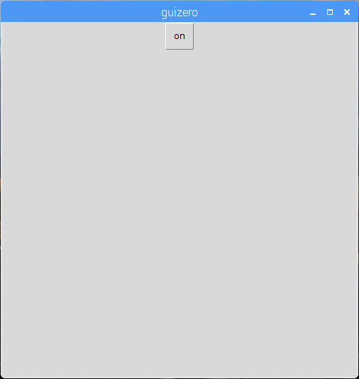
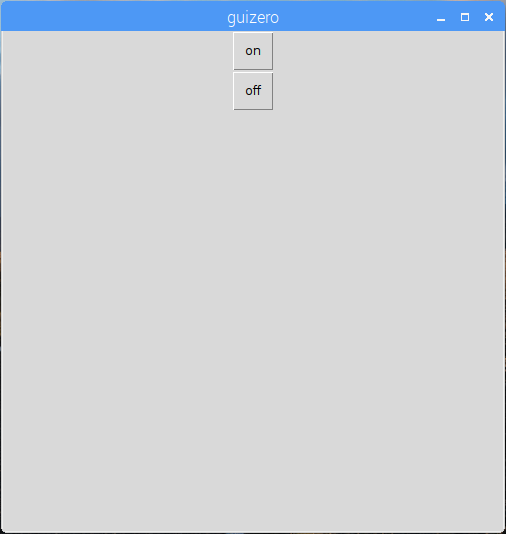
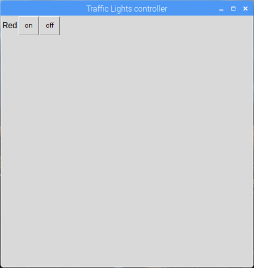
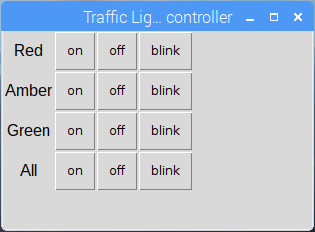

# Traffic Lights controller

Create a traffic lights controller GUI (graphical user interface) using GPIO Zero and guizero.

## Flash the LEDs

1. Open Python 3 from the main menu.

1. Enter the following commands, one-by-one, into the Python shell, and observe the LED:

  (do not type the chevrons `>>>`)

    ```python
    >>> from gpiozero import TrafficLights
    >>> lights = TrafficLights(22, 27, 17)
    >>> lights.on()
    >>> lights.off()
    >>> lights.blink()
    ```

1. Now try blinking the LED at different speeds (the two numbers are (**on time** and **off time**):

  ```python
  >>> lights.blink(2, 2)
  >>> lights.blink(5, 5)
  >>> lights.blink(0.1, 0.1)
  ```

1. Now try flashing all three LEDs at different rates:

    ```python
    >>> lights.red.blink(1, 1)
    >>> lights.amber.blink(2, 2)
    >>> lights.green.blink(3, 3)
    ```

## Create a GUI

1. Open a new window and save it. Now you'll write code in this file rather than directly in the shell.

1. Create a GUI button to turn the red LED on:

    ```python
    from guizero import App, Text, PushButton
    from gpiozero import TrafficLights

    lights = TrafficLights(22, 27, 17)

    app = App()

    PushButton(app, command=lights.red.on, text="on")

    app.display()
    ```

    

1. Add a text label and a second button to turn the red LED off:

    ```python
    Text(app, "Red")
    PushButton(app, command=lights.red.on, text="on")
    PushButton(app, command=lights.red.off, text="off")
    ```

    

1. Now give your app a name, and use the grid layout:

    ```python
    app = App("Traffic Lights controller", layout="grid")

    Text(app, "Red", grid=[0, 0])
    PushButton(app, command=red.on, text="on", grid=[0, 1])
    PushButton(app, command=red.off, text="off", grid=[0, 2])
    ```

    

## Challenges

1. Try adding on/off buttons for all 3 LEDs, making sure they're aligned properly in the grid

    

1. Try adding a blink button for each LED

1. Try adding buttons for all on / all off

1. Try writing your own function to do the traffic lights sequence

    - Use `def sequence()` and set the command to `sequence`
    - Make sure to include `from time import sleep`
