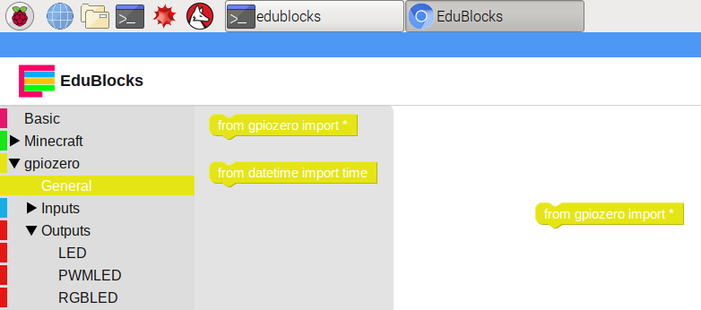
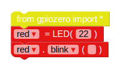
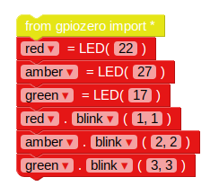
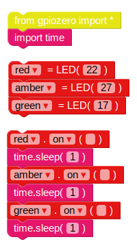
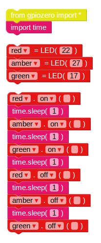
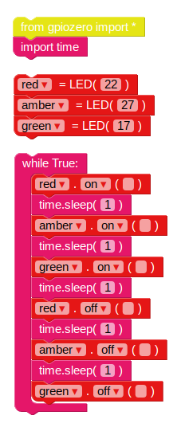

# Traffic lights with EduBlocks

## Connect the LEDs

1. Connect your LEDs to the following pins:

| LED       | GPIO  |
| --------- | :------: |
| Red       | 22       |
| Amber     | 27       |
| Green     | 17       |

## Control the LEDs

1. Open EduBlocks from the Desktop.

1. Click the **gpiozero** drop-down, click **General** and drag the `from gpiozero import *` block into the workspace.

    

1. Click the **Outputs** drop-down under **gpiozero** and click **LED**. Drag an `led = LED(pin)` block into the workspace beneath the import block. Rename the variable from `led` to `red`, and change `pin` to `22`.

1. Drag in an `led.on` block, and dock it beneath the previous block. Change the `on` drop-down to `blink`. Your code blocks should now look like this:

    

1. Now click the **Run** button to run your code. You should see the red LED blink.

1. Now add some more LED blocks to introduce the other two lights, and make them blink at different speeds:

    

1. Run your code again and you should see the three lights flashing at different rates.

1. If a larger number makes a light blink slower, what number would make it run faster? Try to make your lights blink faster.

## Traffic lights sequence

1. The `on` function allows you to turn a light on. You can use `sleep` to pause between commands. Bring in the `import time` block from the **Basic** section. Try this example to turn the lights on in sequence:

    

    The main controls for LEDs are `on`, `off`, `toggle` and `blink`.

1. Try turning the lights on and off in sequence:

    

1. Try repeating this by putting the code inside a `while` loop:

    

1. Now you know how to control the lights individually, and time the pauses between commands, can you create a traffic lights sequence? The sequence goes:

    - Green on
    - Amber on
    - Red on
    - Red and amber on
    - Green on

It's important to think about timing. How long should the lights stay on for at each stage?

Once you have completed the traffic light sequence, you might want to try adding in a button and a buzzer to make an interactive traffic light for a pedestrian crossing.
