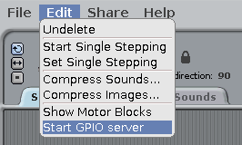
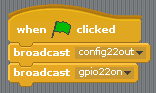
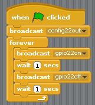
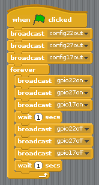
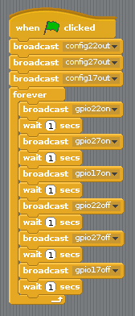

# Traffic Lights with Scratch 1.4

## Connect the LEDs

1. Connect your LEDs to the following pins:

| LED       | GPIO pin |
| --------- | :------: |
| Red       | 22       |
| Amber     | 27       |
| Green     | 17       |

## Control the LEDs

1. Open **Scratch** from the Programming menu (**Scratch** not **Scratch 2**).

1. Click **Edit** in the menu bar and select **Start GPIO Server**:

    

1. Click the **Control** panel and drag in a **when flag clicked** block and two **broadcast** blocks. Dock them together in sequence and edit the broadcasts to say `config22out` and `gpio22on` like so:

    

1. Now click the green flag to run your code. You should see the red LED light up.

1. Now add a **wait 1 secs** block before and after turning the LED off with `broadcast gpio22off`, and wrap it in a **forever** block to blink continuously:

    

1. Now add some more **broadcast** blocks to introduce the other two lights, and make them all flash on and off:

    

1. Click the green flag again and you should see the three lights flash together.

1. Can you change the number in **wait 1 secs** to speed up or slow down the sequence?

## Traffic lights sequence

1. Try turning the lights on and off in sequence:

1. Now you know how to control the lights individually, and time the pauses between commands, can you create a traffic lights sequence? The sequence goes:

    - Green on
    - Amber on
    - Red on
    - Red and amber on
    - Green on

It's important to think about timing. How long should the lights stay on for at each stage?

Once you have completed the traffic light sequence, you might want to try adding in a button and a buzzer to make an interactive traffic light for a pedestrian crossing.
